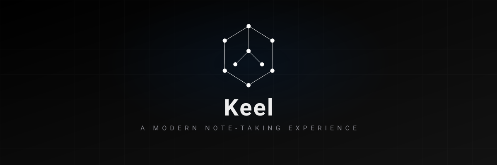
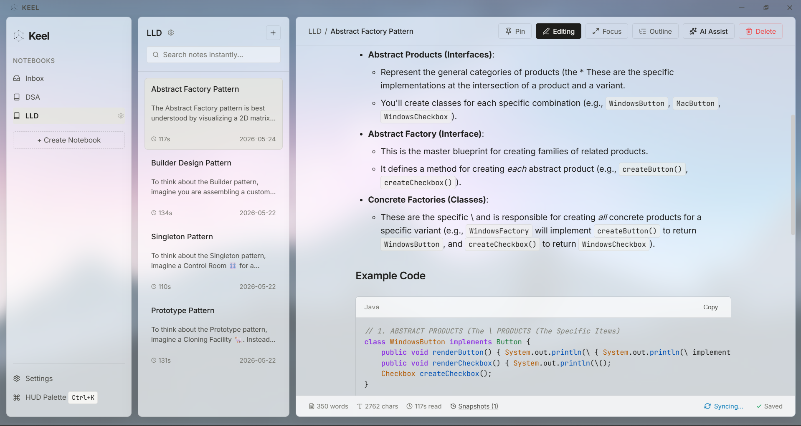
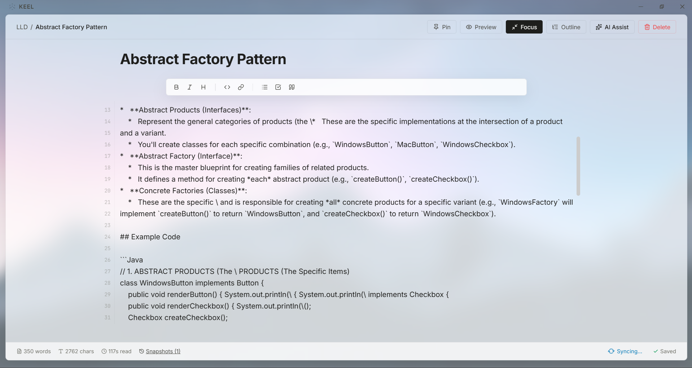
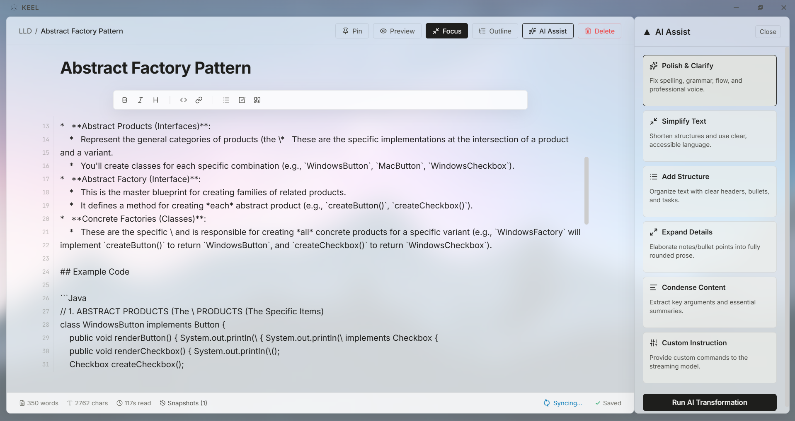
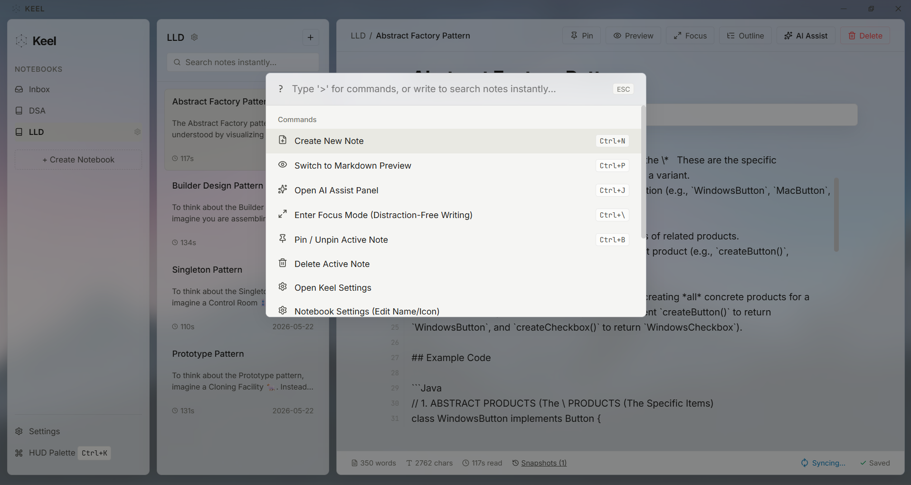
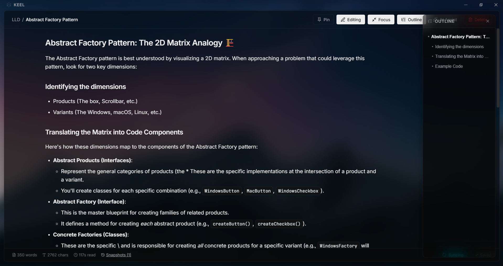
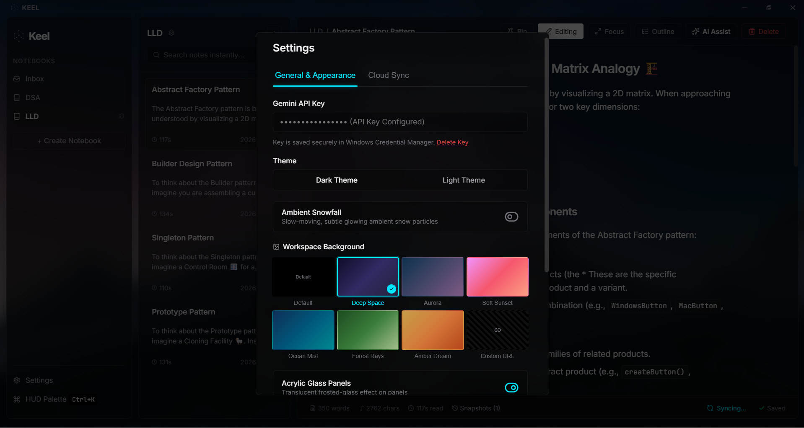

<div align="center">



**A modern, privacy-first note-taking application built for your desktop.**

Crafted with [Tauri v2](https://v2.tauri.app/), [React](https://react.dev/), [TypeScript](https://www.typescriptlang.org/), and [Rust](https://www.rust-lang.org/) for blazing-fast performance and native feel.

[](LICENSE) [](https://v2.tauri.app/) [](https://react.dev/) [](https://www.typescriptlang.org/) [](https://www.rust-lang.org/) [](https://vitejs.dev/)

---



</div>

## Table of Contents

- [About](#about)
- [Features](#features)
- [Tech Stack](#tech-stack)
- [Architecture](#architecture)
- [Getting Started](#getting-started)
  - [Prerequisites](#prerequisites)
  - [Installation](#installation)
  - [Environment Variables](#environment-variables)
  - [Development](#development)
  - [Building](#building)
- [Screenshots](#screenshots)
- [Roadmap](#roadmap)
- [Contributing](#contributing)
- [Security](#security)
- [License](#license)
- [Acknowledgments](#acknowledgments)

---

## About

**Keel** is a lightweight, privacy-focused note-taking application designed for writers, developers, and knowledge workers. All notes are stored locally in a SQLite database, giving you full ownership of your data. With optional cloud sync via Google Drive and AI-powered writing assistance via Google Gemini, Keel adapts to your workflow.

### Why Keel?

- **Privacy by Default** -- Your notes never leave your device unless you explicitly enable sync
- **Native Performance** -- Built with Rust and Tauri for minimal resource usage and instant startup
- **Markdown First** -- Write in Markdown with live preview, syntax highlighting, and GFM support
- **AI-Augmented** -- Optional Gemini integration for writing polish, simplification, and structuring
- **Cross-Device Sync** -- Optional Google Drive sync with conflict resolution

---

## Features

### Core

| Feature | Description |
|---------|-------------|
| **Rich Markdown Editor** | Full GFM support with tables, task lists, strikethrough, and footnotes |
| **Syntax Highlighting** | Code blocks with language-aware highlighting via Syntect |
| **Notebooks** | Organize notes into customizable notebooks with emoji icons |
| **Tags** | Tag-based organization with full-text search |
| **Backlinks** | Automatic bidirectional linking between notes using `[[Title]]` syntax |
| **Snapshots** | Version history with ability to restore any previous state |
| **Pinned Notes** | Pin important notes for quick access |
| **Search** | Full-text search powered by SQLite FTS5 |
| **Drag & Drop** | Reorder notes and move between notebooks |
| **Offline LaTeX Math** | High-fidelity mathematical equations and formula rendering powered by KaTeX |
| **Double-Click Editing** | Double-clicking any word in reading mode immediately opens editor mode at that exact line and cursor word offset |

### AI-Powered Writing

| Mode | Description |
|------|-------------|
| **Polish** | Fix grammar, spelling, and enhance clarity while preserving your voice |
| **Simplify** | Rewrite in plain, accessible language |
| **Structure** | Add headers, bullet points, and organize content |
| **Custom** | Provide your own instructions for AI-assisted editing |

### Cloud Sync

| Feature | Description |
|---------|-------------|
| **Google Drive Sync** | End-to-end encrypted sync with your Google Drive |
| **Automatic Background Sync** | Seamless sync on app launch and at regular intervals |
| **Conflict Resolution** | Visual diff tool to resolve merge conflicts |
| **Incremental Sync** | Only changed files are transferred |
| **Tombstone Tracking** | Proper handling of deleted notes across devices |

### User Experience

| Feature | Description |
|---------|-------------|
| **Command Palette** | `Ctrl+K` quick access to all actions |
| **Focus Mode** | Distraction-free writing environment |
| **Light & Dark Themes** | System-aware theme switching |
| **Moleskine Paper Theme** | Zero-glare, eye-friendly sepia writing aesthetic with organic fiber paper texture and premium editorial typography |
| **Collapsible Sidebar** | Smooth collapsing main navigation sidebar which scales down to a 64px narrow tablet dock view |
| **Context Menus** | Premium right-click options to delete, edit, and pin notes and notebooks instantly |
| **Custom Backgrounds** | Personalize with custom images and blur effects |
| **Glass Morphism** | Optional translucent UI effects |
| **Snow Effect** | Ambient visual effect toggle |
| **Global Shortcuts** | System-wide keyboard shortcuts |

---

## Tech Stack

### Frontend

- **React 19** -- UI library with concurrent features
- **TypeScript 5.8** -- Type-safe JavaScript
- **Zustand** -- Lightweight state management
- **Vite 7** -- Next-generation build tool
- **Lucide React** -- Beautiful icon library

### Backend (Rust)

- **Tauri v2** -- Secure, lightweight desktop framework
- **SQLx** -- Async, compile-time verified SQLite queries
- **Tokio** -- Async runtime for Rust
- **Reqwest** -- HTTP client for API calls
- **Syntect** -- Syntax highlighting engine
- **Pulldown-cmark** -- CommonMark/GFM Markdown parser
- **Keyring** -- OS-native credential storage

### Data Storage

- **SQLite** -- Local database with WAL mode for performance
- **FTS5** -- Full-text search extension
- **OS Keyring** -- Secure storage for API keys and tokens

---

## Architecture

```
keel/
├── src/                          # React frontend
│   ├── components/               # UI components
│   │   ├── AIPanel/             # Gemini AI integration panel
│   │   ├── CommandPalette/      # Quick action launcher
│   │   ├── Editor/              # Markdown editor
│   │   ├── NotesList/           # Note listing
│   │   ├── Sidebar/             # Notebook navigation
│   │   └── SettingsModal/       # Application settings
│   ├── stores/                  # Zustand state management
│   │   └── slices/              # Feature-specific store slices
│   └── App.tsx                  # Root application component
│
├── src-tauri/                    # Rust backend
│   ├── src/
│   │   ├── commands.rs          # Tauri command handlers
│   │   ├── db.rs                # Database initialization & schema
│   │   ├── gdrive.rs            # Google Drive OAuth & API
│   │   ├── gemini.rs            # Gemini AI integration
│   │   ├── markdown.rs          # Markdown rendering engine
│   │   └── sync_engine.rs       # Cloud sync orchestration
│   ├── capabilities/            # Tauri security permissions
│   └── Cargo.toml               # Rust dependencies
│
├── docs/
│   └── screenshots/             # Application screenshots
│
└── package.json                 # Node.js dependencies
```

---

## Getting Started

### Prerequisites

- **Node.js** >= 18.x
- **Rust** >= 1.75 (install via [rustup](https://rustup.rs/))
- **Visual Studio Build Tools** (Windows) or equivalent C++ toolchain
- **WebView2** (Windows 10/11 -- usually pre-installed)

### Installation

1. **Clone the repository**

   ```bash
   git clone https://github.com/yourusername/keel.git
   cd keel
   ```

2. **Install frontend dependencies**

   ```bash
   npm install
   ```

3. **Set up environment variables**

   ```bash
   cp .env.example .env
   ```

4. **Edit `.env` with your credentials** (see [Environment Variables](#environment-variables))

### Environment Variables

Create a `.env` file in the project root:

```env
# Google OAuth credentials (required for cloud sync)
GOOGLE_CLIENT_ID=your_client_id_here
GOOGLE_CLIENT_SECRET=your_client_secret_here
```

> **Note:** Cloud sync is optional. The app works fully offline without these variables.

To obtain Google OAuth credentials:
1. Go to [Google Cloud Console](https://console.cloud.google.com/)
2. Create a new project or select an existing one
3. Enable the Google Drive API
4. Create OAuth 2.0 credentials (Desktop application type)
5. Copy the Client ID and Client Secret to your `.env` file

### Development

Start the development server with hot-reload:

```bash
npm run tauri dev
```

This will:
- Start the Vite dev server for the React frontend
- Compile and run the Tauri/Rust backend
- Open the application window

### Building

Create a production build:

```bash
npm run tauri build
```

The built application will be available in `src-tauri/target/release/bundle/`.

---

## Screenshots

<div align="center">

### Editor View


### AI Writing Assistant


### Command Palette


### Dark Mode


### Settings


</div>

---

## Roadmap

- [ ] **Export/Import** -- PDF, HTML, and Markdown file export
- [ ] **Plugin System** -- Extensible architecture for community plugins
- [ ] **Collaborative Editing** -- Real-time collaboration features
- [ ] **Mobile Companion** -- iOS/Android companion app with sync
- [ ] **End-to-End Encryption** -- Client-side encryption for cloud sync
- [ ] **Custom Themes** -- User-created theme support
- [ ] **Graph View** -- Visual knowledge graph of note connections
- [ ] **Templates** -- Pre-built note templates
- [ ] **Web Clipper** -- Browser extension for saving web content

---

## Contributing

We welcome contributions! Please see our [Contributing Guidelines](CONTRIBUTING.md) for details.

1. Fork the repository
2. Create your feature branch (`git checkout -b feature/amazing-feature`)
3. Commit your changes (`git commit -m 'feat: add amazing feature'`)
4. Push to the branch (`git push origin feature/amazing-feature`)
5. Open a Pull Request

### Development Guidelines

- Follow [Conventional Commits](https://www.conventionalcommits.org/) for commit messages
- Run `npm run lint` and `cargo clippy` before submitting
- Add tests for new features
- Update documentation as needed

---

## Security

Keel takes security seriously:

- **Local-First Storage** -- All data stored in local SQLite database
- **OS Keyring Integration** -- API keys stored in native credential manager (Windows Credential Manager, macOS Keychain, Linux Secret Service)
- **No Telemetry** -- Zero analytics or tracking
- **CSP Configuration** -- Content Security Policy for webview
- **Input Sanitization** -- HTML escaping to prevent XSS injection

For security vulnerabilities, please email [security@keel-app.dev](mailto:security@keel-app.dev) instead of opening a public issue.

---

## License

This project is licensed under the MIT License -- see the [LICENSE](LICENSE) file for details.

---

## Acknowledgments

- [Tauri](https://tauri.app/) -- For the incredible desktop framework
- [React](https://react.dev/) -- For the UI library
- [Rust](https://www.rust-lang.org/) -- For performance and safety
- [Lucide](https://lucide.dev/) -- For the beautiful icons
- [Syntect](https://github.com/trishume/syntect) -- For syntax highlighting

---